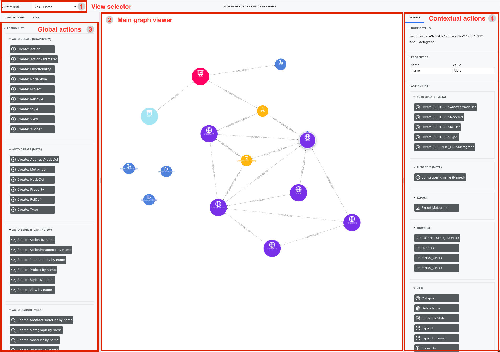
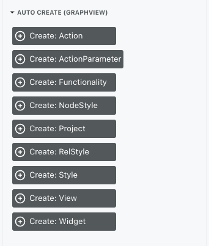
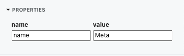
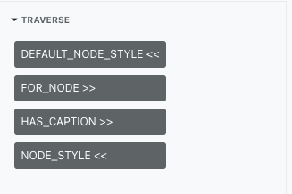

# Designer

## Idea

The idea behind this designer is to simplify editing of a graph. 

We believe that having the schema of the graph or model that can be interpreted by designer will help as create more intuitive and guided UI.

The main idea is, that designer "understand" the graph - and it can create all functionality base on this knowledge.\
Because of understanding underlying model of a data, designer could restrict us to be able to add only valid data nad valid actions. 

The main functionality like CRUD operations and traversals are generated automatically because of that. 

All other additional functionality we can add for specific view or for specific type of node or relationship. This functionality will only appear in designer for relevant elements, for all other will remain hidden.

> To use our designer we recommend the following steps:
> - Create view for editing your model of the data (see [views page](Views.md))
> - Create model of your data [model page](Models.md)
> - Create your view for editing data (see [views page](Views.md))
> - Play with your data

But first let see designer structure and functionality

## Designer connection 

Designer is connected to a NEO4J database that is deployed with this project in docker container named `designer-neo4j` \
Database is available at `http://localhost:7474/` \
But for showing the data inside this designer, data need to equipped with models (see more at [model page](Models.md)) 

## Structure of designer

Our designer is structure with four main elements.

1. View selector
2. Main graph viewer 
3. Global actions 
4. Contextual actions

### View selector

Inside our designer, you can define and create multiple `views`. Inside view, you could define how you would like to see graph data. 
>Inside `view` you could define:
>- initial query to show initial data
>- actions that you can use inside this view
>- styling of nodes and relationships 

To see how to create new view visit [views page](Views.md)
## Main graph viewer

`Main graph viewer` is a graph viewer where you can visualise and manipulate graph data.\
Data that is visualised depends on initial query of the selected view. The action can then add or remove additional data to this view.

Nodes and relationships are clickable and movable.\
When we select the node or the relationship, all actions that can be performed on this element are shown in `contextual action window`. 
#### Style
The visualisation of the nodes and relationships depends on styling defined in selected view.
#### Position
All positions of the nodes is saved for this view automatically. This means, if you rearrange nodes and then reload browser, all positions of nodes will be preserved.
Positions are preserved even when nodes are being hidden.

## Global actions

Based on the model behind your data (for more information see [model page](Models.md)) inside your view, global actions are automatically created.\
`Global actions` are actions that are performed on a view, or not for specific node/relationship.\ 
Predefined actions are:

### Create [node]
This creates new node of type [node]. Types are collected from model behind your data, and for each type new action is created.

### Search [node.prop]
This search for a node with specific property value. Node types as well as properties are collected from model behind your data, and for each pare new action is created.\
All possible values (when possible) are collected and presented in drop-down menu. 

 

### Run Cypher File

This method runs the cypher file that we have saved in container. The cypher function need to return specific outputs variables, so it is compatible with our designer.\
> **NOTE** Need to be added

### Fine node by UUID

This method find the node with specific UUID. Our Designer create UUID for every node in the NEO4J database. This helps us with transferring actions and models to other users. 
You can see the node UUID inside `Contextual actions view`

### Fine node by type

This method search for all nodes by specific type. It is similar to `Search [node.prop]`, but it doesn't filter by any value or properties. Node types are collected from model behind your data.\

### Query

Similar than `Run Cypher File`, but it allows you to put cypher directly inside text box and run it. The cypher function need to return specific outputs variables, so it is compatible with our designer.\
> **NOTE** Need to be added
> 
### Refresh View

This function refresh view to a initial query. It removes all additional nodes that was added to a view by actions. \
This is a great way to restart view to a starting point. 

## Contextual actions

This view is connected to a selected element on `Main graph viewer`\
This view re-renders differently for each element that is selected.\
It shows details of the selected element and all actions that could be performed on this element. 

It shows:

### Details
It shows Node or Relationship `UUID` and `label` 

### Properties 
It show all properties this element has and his values. 

### Actions
This is all actions that can be performed on this element

> By default, you get those actions from underlying model 

#### Create [node with relationship]

Create neighbour node with specific relationship to it. This helps us quickly create nodes that is valid in our schema (underlying model)\
For all properties of new element we get automatically form to fill in.

#### Edit [properties]

For each property of the selected element, new action to edit these properties is created. The properties are collected from underlying model (schema).

#### Traverse [Relationship]

This action traverse graph by relationship [Relationship]. Relationships are collected from model behind your data (schema), and for each relationship new action is created.
Traverse show all nodes that has [Relationship] to selected node. 

> **NOTE** If you have a super node, and a lot of nodes with [Relationship] to selected node, visualisation could cause node explosion

#### Expand

Expand is a function that will expand all relationships and neighbour nodes from selected node. \
This method will expand only those relationships that goes from selected node to neighbour node. (selected node is source node for relationship)\
The same functionality we get with double tap on the node.

> **NOTE** If you have a super node, and a lot of nodes with [Relationship] to selected node, visualisation could cause node explosion

#### Expand Inbound
This function works the sam way as `Expand` function, but for reverse direction of the relationships.\
This function will only expand neighbour nodes with relationships directed from neighbour node to selected node (neighbour node is source node for relationship)

#### Collapse

Collapse is reverse function for `Expand`. It hides all nodes that are connected to a selected node, but not selected node.

#### Delete 

This function delete node or relationship in NEO4J database and hide it on the screen.  

#### Edit Style

Edit style will help you edit style for all nodes that are of the same type as selected node. 
You can choose the:
- color of the element type (node/relationship)
- icon that is shown on the element of this type
- size of the node (**node only**)
- line width (**relationship only**)
- line style (**relationship only**)

#### Focus On

Focus on function hides all other element but selected node. 

#### Hide

This function will hide selected element (node or relationship)

