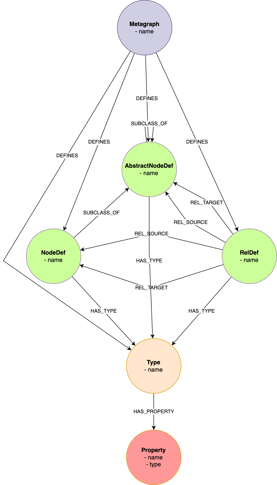

# Meta Model

## Idea

Idea is that you describe all your data with a model or a schema. 

Providing designer with a model of your data, helps him predefined actions that are available to you. 

Designer could see, witch type of nodes exist in your model, and provide all Global actions like 
search, create, ... for those nodes.

When select specific element, designer could see, to witch other nodes and relationship this element could be 
connected (what is valid), and prepare all functions like traversal, creating new (valid) connection, editing properties...

>Model defines:
>- Witch nodes exist in model (type)
>- Witch relationships exist in model (type)
>- What are valid connections between nodes
>- Valid properties for node and relationship

You provide schema of your data by creating model of this data

## Model

>**NOTE** TO BE EDIT

#### Metagraph

Metagraph is a node that 'owns' the model. Every NodeDef and RelDef need to belong to one Metagraph. 
This way, the transition, sharing and versioning is possible. You can share specific metagraph and all elements that belong to it.

> **PROPERTIES**:
> - name: Name of Metagraph

#### DEFINES
This is relationship that connect Metagraph and all elements that metagraph owns.

#### NodeDef
NodeDef is a node that represent Node in schema. This node has specific type.

> **PROPERTIES**:
> - name: Name of an NodeDef

#### RelDef
RelDef is a node that represent Relationship in schema. The reason tha relationship is also a node in schema is that we could
point to it, and define it a properties and types.

> **PROPERTIES**:
> - name: Name of an RelDef

#### REL_SOURCE
This relationship defines the directions of the node RelDef relationship. Because relationship is directed between two nodes,
in our model there is RelDef node between twe NodeDef. One relationship need to be REL_SOURCE and defines source node of the relationship.

#### REL_TARGET
This relationship defines the directions of the node RelDef relationship. Because relationship is directed between two nodes,
in our model there is RelDef node between twe NodeDef. One relationship need to be REL_TARGET and defines target node of the relationship.

#### Type
This node represents the Type of the NodeDef and RelDef. It is a container for all Properties. So all NodeDefs (or RelDefs) with same type has same properties.
NodeDef (or RelDef) could have more than one type. NodeDef then has all properties from all Types.

> **PROPERTIES**:
> - name: Name of Type

Rule is, that there should not be the same properties named in two different Types and has different type. 
If NodeDef has two Types and those two types has same properties (named), NodeType will only have one those properties. 

#### Property

Properties is a node that represent properties for a NodeDef or a RelDef. 

> **PROPERTIES**:
> - name: Name of Properties
> - type: Type of Properties (String, Boolean, Integer, DateTime)
