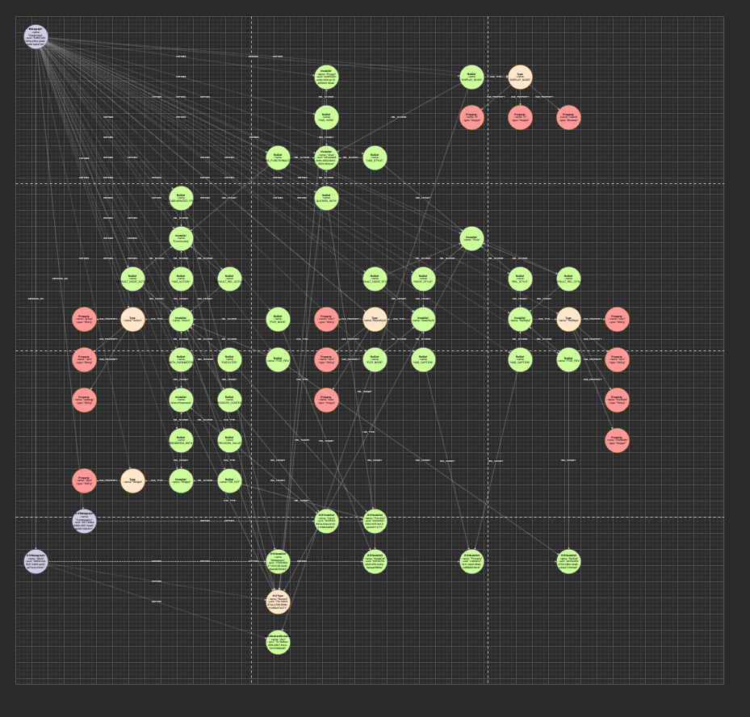
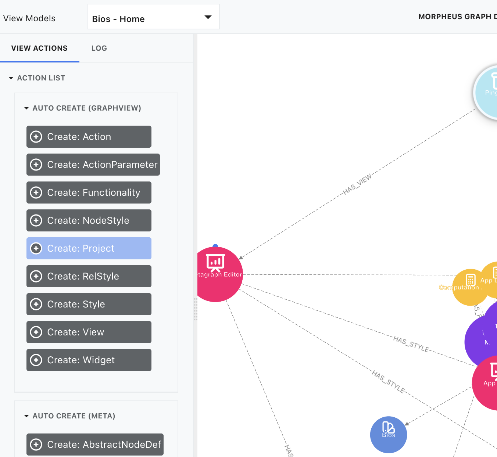
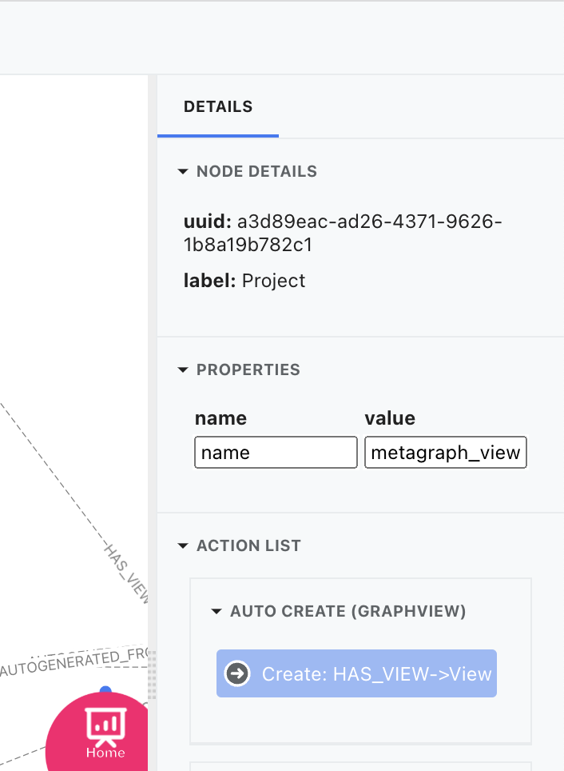
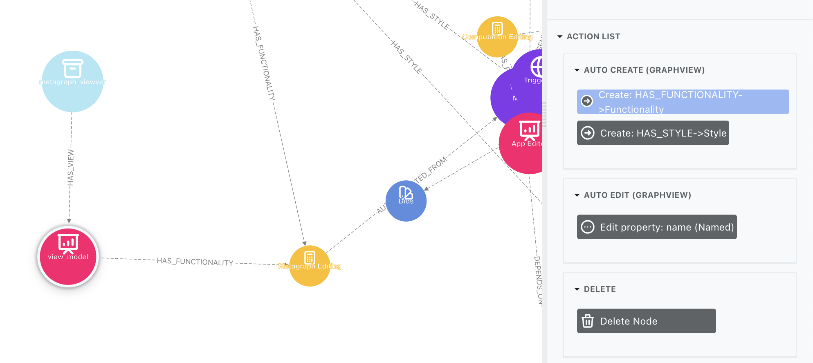
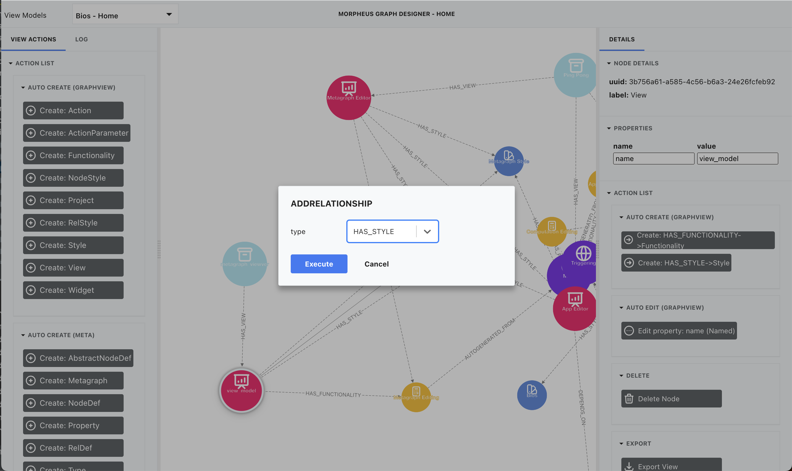

# Views

## Idea 

Idea is that you could create your own views inside designer with a graph. 

View contains witch data are you looking at, how it is presented (styling) and witch actions are available for this view. 

>View defines:
>- data that is presented
>- styling of the data
>- position of the nodes
>- available actions

You create new view my modeling data in a graph for this we could first look at view model. 

## Model

>**NOTE** TO BE EDIT

#### Project

Project is a node that connect all connected views in one project.\
You can think of it as a folder if View is a file.

Each `Project` can have many Views and all `Views` needs one `Project`

> **PROPERTIES**:
> - name: Name of a Project

#### View

View is a one canvas on witch nodes will be displayed. All views are presented in `View selector` drop down menu on main screen.
View is main node that holds all information how view should be rendered and witch functionality has. 

You can think of Views as Apps - you define what is presented on the view and what would user be able to do on it.\
Also, all custom actions are bind to a specific view.

> **PROPERTIES**:
> - name: Name of a View

#### Functionality

Functionality is a hyper node that collects all different functionality and link them to a View.\
Functionality can be reused. 

Functionality can be:
- Automatically generated from `Metagraphs`
- Generate from `Action` that is user defined.

> **PROPERTIES**:
> - name: Name of a Functionality

#### Action

Action is a hyper node that combines all information so that Designer can perform action.\
Actions can be:
- **Global**: This means that it is run independently on selected element. It applies to View instead on selected node.
- **Contextual**: This means that this action will be performed on selected element. It takes the selected element as a parameter. For contextual functions user need to define for witch type of node can be performed (what type of node function expect as a parameter)

> **PROPERTIES**:
> - name: Name of an Action
> - group: Action is visually grouped together. Action with same group will be placed in same stack.
> - icon: Icon defines what icon will be displayed alongside name in action view (global and contextual)
> - strategy: Strategy defines how this action is performed
>  - APPEND: This will add all node returned by action to existing view. (Example - Search)
>  - REFRESH: This will trigger refresh of the view. This means that initial query will be run. 
>  - REPLACE: This will only present node return from action. It will hide all others. 
>  - DELETE: This will remove (hide) returned nodes from view, but leave all other on the screen.
>  - LAZY_UPDATE: Similar than APPEND, but it doesn't trigger screen rendering. This is useful for actions when UI already update state. Example, move node and save position of the node. 

#### Action Parameter

Action could have more parameters, not only selected element (contextual actions). For every parameter that our function has, a `Action Parameter` node need to be created.\
For action parameter we could define from where this parameter will come from.\
It could be a constant, or it is linked to a widget. 

> **PROPERTIES**:
> - name: Name of a Parameter

#### Widget

Widget is a node that represent UI element for selecting and/or defining parameter of an action.\
With widget we defined what kind of UI element will be presented on the pop-up form when action is performed. 

If non widget is linked to an action, action will be performed without pop-up screen. (silently)

Widget could have implemented relationship `ON_INIT` to a `Function`. This will fill the predefined values for UI element.\
This is most important to a fields like `dropDown` because this function fill the predefined values available in dropDown. 

> **PROPERTIES**:
> - type: type of UI element of a widget
>  - textField
>  - textArea
>  - checkBox
>  - numberField
>  - colorPicker
>  - dropDown
>  - iconPicker

#### Style

Style is a hyper node that aggregates `Node Styles` and `Rel Styles` that logically belongs together.\
This allows as to create predefined styles for Views that can be reused.

Style is a collection of:
- Node Styles
- Rel Styles

> **PROPERTIES**:
> - name: Name of a Style

#### Node Style

Node style defined how specific node type will be presented on screen. It defines color, size... of a node. 
Node Style can be for a specific Node Type (linked to a `NodeDef`) or default node style (linked to a `View` only).
Specific node style override default node style.

> **PROPERTIES**:
> - color: Hex value for a color of a node. 
> - icon: Name of predefined icon that will be presented inside node. 
> - size: Size of the node in px (normal size is about 100)

#### Rel Style

Rel style defined how specific relationship type will be presented on screen. It defines color, size... of a relationship.
Rel Style can be for a specific Rel Type (linked to a `RelDef`) or default rel style (linked to a `View` only).
Specific rel style override default rel style.

> **PROPERTIES**:
> - color: Hex value for a color of a node.
> - icon: Name of predefined icon that will be presented inside node.
> - lineStyle: style of a line that is drawn for a relationship
>  - solid
>  - dotted
>  - dashed
> - lineWidth: width of the line for relationship in px

## Creating new view

To create new `view`, we could firstly create new `project`. If you already have project you don't need to do that.
- Firstly go to the Bios View in the `View selector`. 
- There select `Create Project` from the global actions on the left panel. 
- Add name of your new project.
- Then select your project node.
- Select `Create View` from `Contextual actions` on the right panel. 
- Set name for the view.
- Then connect newly created View node to Functionality we like. 
  - If there is no Functionality we need, we could create new one, by selecting our `View` node and select `create Functionality`.
  - Connect Functionality to a relevant Metagraphs by AUTOGENERATED_FROM. Select Metagraphs from witch nodes you would like to have autogenerated actions like search, create, traverse, edit...
- Connect newly created View node to Style we like 
  - If there is no Style we need, we could create new one, by selecting our `View` node and select `create Style` from contextual actions.
  - Select new style, and create new Node Style with properties. Connect This Node Style to relevant NodeDef
  - Select new style, and create new Rel Style with properties. Connect This Rel Style to relevant RelDef
- For initial load of a View, create relationship `QUERIES_WITH`, to a `Function`
- For now, we recommend creating relationship `IMPLEMENTED` from `Function` to `NativeCall`. NativeCall has a property Cypher in witch you can define initial load (return nodes that you would like to see).
